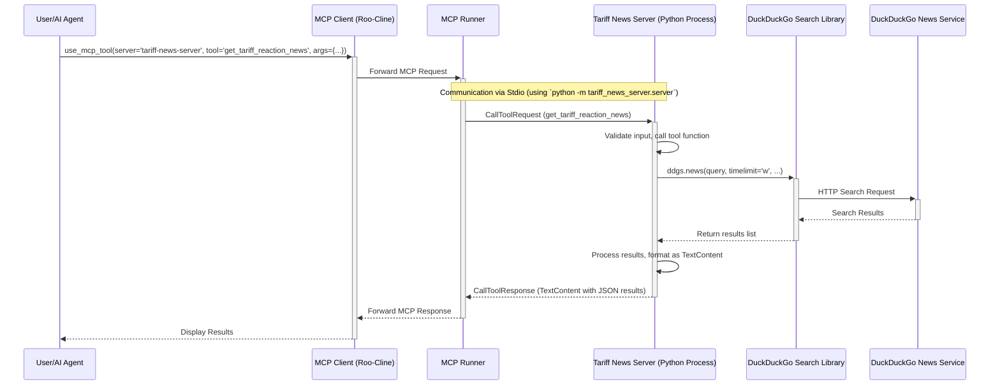

# Tariff News MCP Server
The MCP server `tariff-news-server` has been updated to support both stdio and SSE transports, selectable via a command-line argument. The necessary dependencies and code structure are in place. The server should start correctly in either mode, and the `get_tariff_reaction_news` tool is available.

## Installation 

Download code
```
git clone https://github.com/shanscar/Tariff-News-MCP-Server.git
cd tariff-news-server
pip install -r requirements.txt
pip install -e .
```
Run transport stdio 
```
python -m tariff_news_server.server
```
Run  transport  sse
```
python -m tariff_news_server.server --transport sse
```

## mcp_settings.json
```
{
  "mcpServers": {
    "tariff-news-server": {
      "command": "python",
      "args": [
        "-m",
        "tariff_news_server.server"
      ],
      "env": {},
      "disabled": false,
      "alwaysAllow": []
    }
  }
}
```

# Toolstack
```
VS Code
Roo Code
MCP Python SDK
Google Gemini 2.5 Pro
```

## Solution Diagram

I have generated a Mermaid sequence diagram illustrating the solution architecture for the Tariff News MCP Server. The diagram shows the interaction between the user, the MCP client, the MCP runner, the Python server process, the DuckDuckGo search library, and the external DuckDuckGo service to fulfill a tool request.

